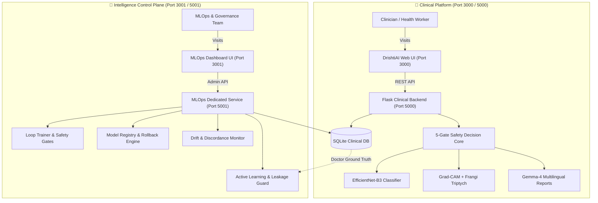

# 👁️ DrishtiAI

**Production-Hardened AI Retinal Screening Platform & Autonomous MLOps Intelligence Control Plane**  
*Empowered by Dual-Model Deep Learning, Explainable AI (XAI), Gemma-4 Multilingual Intelligence, and Continuous Closed-Loop Governance.*

[](docs/clinical/safety.md)
[](docs/API.md)
[-amber.svg)](docs/clinical/limitations.md)
[-brightgreen.svg)](tests/)
[](src/components/AccessibilityToolbar.tsx)

---

## ⚠️ Clinical Positioning & Non-Autonomous Scope

> **IMPORTANT CLINICAL NOTICE:**  
> DrishtiAI is architected as an **AI-powered screening and clinical decision-support tool (Software as a Medical Device - SaMD Class II)** designed to assist ophthalmologists, optometrists, and rural health camp operators in identifying signs of Diabetic Retinopathy (DR). **It is NOT an autonomous diagnostic system and does not replace examination by a licensed medical practitioner.** All AI recommendations enforce `DECISION_SUPPORT` automation levels requiring qualified human review before medical intervention or discharge.

---

## 🌟 Platform Overview & Dual-Plane Architecture

DrishtiAI operates as two strictly isolated yet harmonized runtime planes:

1. **Clinical Screening Platform** (`Port 3000` / `Port 5000`):
   - Clinician-focused, distraction-free screening interface (WCAG 2.2 AAA accessible).
   - Micro-second fundus validation, optic disc/fovea landmark analysis, and lesion localization.
   - Dual-model deep learning consensus with Grad-CAM saliency and Frangi capillary segmentation.
   - Empathetic Gemma-4 multi-lingual clinical reports with audio narration in English, Hindi (हिंदी), and Gujarati (ગુજરાતી).
   - Offline rural eye-camp sync ledger with conflict-preserving reconciliation.

2. **Intelligence Control Plane (MLOps)** (`Port 3001` / `Port 5001`):
   - Dedicated administrative and continuous learning governance plane.
   - Ground-truth feedback loop ingesting doctor-verified screening reviews.
   - Leakage-free dataset builder with cryptographic SHA-256 fingerprinting.
   - Closed-loop training orchestrator with progressive-unfreezing curriculum.
   - Automated clinical safety gates (referable DR sensitivity $\ge 90\%$, specificity $\ge 85\%$).
   - Dual-role governance approvals (Separation of Duties between Super Admin and Clinical Reviewer).
   - Real-time clinical discordance and feature drift monitoring with 1-click emergency rollback.



---

## ✨ Key Capabilities

### 🛡️ 1. Clinical Screening & Safety Decision Core
- **5-Gate Safety Architecture**:
  1. *Ingest & Binary Hygiene*: Magic bytes validation, decompression bomb rejection (>25 MP), and blank frame blocking.
  2. *Anatomical & Laterality Verification*: Automated optic disc and fovea landmark detection; cross-checks declared laterality (OD vs OS) and halts on conflicts.
  3. *Out-of-Distribution (OOD) Pipeline*: 3-tier pipeline rejecting non-retinal imagery (pets, documents, skin lesions).
  4. *Multi-Model Consensus*: Dual-model agreement evaluation with automatic escalation on diverging severity stages.
  5. *Deterministic State Machine*: Fail-safe transitions (`QUALITY_FAILED`, `ANATOMY_FAILED`, `SCREENING_UNCERTAIN`, `CONFLICT_REQUIRES_REVIEW`).
- **Explainability Triptych**: High-resolution original fundus, multi-scale Frangi vessel extraction, and Grad-CAM attention localization heatmap.
- **Gemma-4 Multilingual Reports**: Real-time diagnostic narratives synthesized for both clinical records and patient counseling.
- **Offline Camp Resilience**: Local outbox queue with conflict-preserving delta synchronization for outreach eye camps with zero cellular coverage.

### 🔬 2. MLOps Intelligence Control Plane
- **Ophthalmologist-in-the-Loop Active Learning**: Screens reviewed and confirmed by licensed doctors automatically qualify for retraining cohorts.
- **Zero-Leakage Dataset Builder**: Strict patient-level stratification preventing the same eye/patient from co-existing across train, validation, and test splits.
- **Automated Safety Gate Enforcement**: Candidate models must pass strict non-negotiable metrics before registry qualification:
  - Referable DR Sensitivity $\ge 90.0\%$
  - Referable DR Specificity $\ge 85.0\%$
  - Quadratic Weighted Kappa $\ge 0.85$
  - Expected Calibration Error (ECE) $\le 0.10$
- **Separation of Duties & Multi-Party Governance**: No single individual can promote a model. Requires independent sign-off from both `SUPER_ADMIN` and `CLINICAL_REVIEWER`.
- **Drift & Discordance Engine**: Kolmogorov-Smirnov and Wasserstein drift detection combined with doctor-vs-model discordance tracking.
- **1-Click Emergency Rollback**: Revert production inference to previous stable checkpoints with zero downtime and state preservation.

---

## 📁 Repository Structure

```
DrishtiAI / OptiGemma
├── app.py                         # Clinical Platform Flask API Server (Port 5000)
├── mlops_server.py                # Intelligence Control Plane Dedicated Server (Port 5001)
├── config.py                      # Clinical platform configuration & policy loader
├── config_admin.py                # MLOps & governance configuration loader
├── database.py                    # SQLite schema, migrations (v1-v4), sync ledger, ORM
│
├── backend/
│   └── admin_api/                 # MLOps REST route handlers & blueprint
│       ├── __init__.py
│       └── routes.py              # Models, datasets, training, approvals, drift endpoints
│
├── engine/                        # Core Clinical & AI Safety Engine
│   ├── safety/                    # Image validation, Anatomy landmarks, OOD detection
│   ├── clinical/                  # Progression, Referral rules, Medical RAG, Safety policy
│   ├── pipeline/                  # IQA, Frangi segmentation, Grading, Grad-CAM
│   ├── sync/                      # Offline outbox ledger & conflict reconciliation
│   └── security/                  # RBAC, JWT tokens, audit logging
│
├── ml_platform/                   # Enterprise MLOps & Continuous Learning Subsystem
│   ├── active_learning/           # Candidate qualification & uncertainty sampling
│   ├── data/                      # Leakage prevention, provenance, quality auditing
│   ├── datasets/                  # Immutable versioning, builder, patient splitting
│   ├── drift/                     # Clinical discordance & feature drift monitors
│   ├── evaluation/                # Evaluator, safety gates, regression tester
│   ├── governance/                # Dual-approval sign-off & append-only audit trail
│   ├── registry/                  # Semantic versioning, staging, rollback manager
│   └── training/                  # Preset configs & background thread orchestrator
│
├── src/                           # Frontend React / TypeScript UI
│   ├── App.tsx                    # Root container with port-based routing isolation
│   ├── components/
│   │   ├── Navigation.tsx         # Clean clinical sidebar (zero MLOps distraction)
│   │   ├── DashboardView.tsx      # Clinical screening metrics & risk distribution
│   │   ├── NewScanView.tsx        # Fundus upload, explainability triptych & reports
│   │   ├── BatchScreeningView.tsx # Mobile camp batch screening queue
│   │   ├── PatientDirectoryView.tsx # Longitudinal records & HbA1c tracking
│   │   ├── AccessibilityToolbar.tsx # WCAG AAA toolbar with speech synthesizer
│   │   └── admin/                 # Dedicated MLOps Control Plane UI
│   │       ├── AdminLayout.tsx    # Governance navigation & role switcher
│   │       ├── AdminDashboard.tsx # Platform operational telemetry
│   │       ├── DatasetManager.tsx # Versioned dataset generation & inspection
│   │       ├── TrainingRuns.tsx   # Loop training job submission & loss curves
│   │       ├── ModelRegistry.tsx  # Candidate models, staging & rollback controls
│   │       ├── DriftMonitor.tsx   # Feature drift & clinical discordance charts
│   │       ├── ApprovalWorkflow.tsx # Dual-approval sign-off modal
│   │       ├── AuditLog.tsx       # Immutable compliance ledger
│   │       └── SystemHealth.tsx   # Component-level diagnostic probes
│   ├── context/                   # Medical data & accessibility contexts
│   └── types.ts                   # Authoritative TypeScript domain interfaces
│
├── workers/                       # Background task queue workers
│   ├── dataset_worker.py          # Asynchronous dataset creation
│   ├── training_worker.py         # Long-running model training execution
│   ├── evaluation_worker.py       # Automated safety gate verification
│   ├── drift_worker.py            # Periodic discordance checks
│   └── release_worker.py          # Staging promotion & rollback execution
│
├── tests/                         # Complete Automated Test Suite (31 test modules, 230+ tests)
├── docs/                          # Comprehensive Engineering & Regulatory Documentation
│   ├── architecture/              # Platform topology & data flow guides
│   ├── clinical/                  # Human-in-the-loop guidelines, safety, limitations
│   ├── mlops/                     # Dataset versioning, training lifecycle, drift monitoring
│   ├── runbooks/                  # Deployment, disaster recovery, rollback procedures
│   └── security/                  # Threat model, RBAC policies, authentication specs
│
├── models/                        # Deep learning checkpoints & calibration metadata
├── infra/                         # Docker, Kubernetes, CI/CD, and Prometheus configs
├── render.yaml                    # Render cloud deployment specification
└── vercel.json                    # Vercel frontend deployment specification
```

---

## 🚀 Quick Start Guide

### Prerequisites
- **Python 3.10+** (Tested on Python 3.11.9)
- **Node.js 18+** & **npm**
- **SQLite 3**

### Option A: Running the Clinical Screening Platform
To launch the primary screening platform for healthcare workers:

```bash
# 1. Install dependencies
pip install -r requirements.txt
npm install

# 2. Launch Clinical Flask API (Port 5000)
python app.py

# 3. In a separate terminal, launch Clinical UI (Port 3000)
npm run dev
```
*Access the clinical dashboard at `http://localhost:3000`.*

### Option B: Running the Intelligence Control Plane (MLOps)
To launch the continuous learning, training orchestration, and governance plane:

```bash
# 1. Launch Dedicated MLOps Backend Service (Port 5001)
python mlops_server.py

# 2. In a separate terminal, launch MLOps Frontend Portal (Port 3001)
npm run dev:mlops
```
*Access the MLOps control plane at `http://localhost:3001`.*

---

## 🧪 Comprehensive Automated Test Suite

DrishtiAI enforces rigorous testing across 31 test suites comprising **230+ unit, integration, adversarial, and invariant tests**:

```bash
# Run the complete test suite with pytest
pytest --tb=short

# Run standard Python unittest discovery (mirrors CI/CD)
python -m unittest discover tests -v

# Run TypeScript typecheck
npm run lint
```

### Key Test Suites:
| Test Suite | Focus Area |
| :--- | :--- |
| `tests/test_e2e_full_lifecycle.py` | Full 11-stage pipeline: Screening $\rightarrow$ Sync $\rightarrow$ Doctor Review $\rightarrow$ Dataset $\rightarrow$ Training $\rightarrow$ Safety Gates $\rightarrow$ Dual-Approval Promotion $\rightarrow$ Rollback |
| `tests/test_safety_core.py` | Ingest hygiene, decompression bomb cutoff, corrupted byte rejection, SHA-256 fingerprinting |
| `tests/test_failure_injection.py` | Red-team suite: domain shift rejection, duplicate image caching, corrupt fundus handling |
| `tests/test_state_machine.py` | Finite state machine legal/illegal transitions and non-happy-path error recovery |
| `tests/test_training_orchestration.py` | Background training job lifecycle, presets, and race-condition cancellation safeguards |
| `tests/test_governance.py` | Separation of duties enforcement, multi-role approval rules, immutable audit trail |
| `tests/test_model_registry.py` | Model version registration, runtime compatibility, staging lifecycle, and promotion gates |
| `tests/test_drift_monitoring.py` | Clinical discordance evaluation and input/output distribution shift alerts |
| `tests/test_offline_sync.py` | SQLite outbox event lifecycle, sync failure retries, conflict resolution policies |

---

## ☁️ Cloud Deployment Configuration

DrishtiAI is configured for automated zero-friction deployment to cloud platforms:

- **Render (Clinical Backend)**: Managed via [render.yaml](render.yaml) & [Procfile](Procfile). Deploys **only** the clinical Flask API (`app:app` on port `$PORT`). MLOps services remain safely private.
- **Vercel (Clinical Frontend)**: Managed via [vercel.json](vercel.json). Deploys the static production bundle (`npm run build`). MLOps view routing is strictly disabled on public domains via client-side environment guards.

---

## 📜 Regulatory & Architectural Documentation

For deep technical dives, review our complete documentation library in [`docs/`](docs/):

- 📐 [**System Architecture**](docs/architecture/clinical-platform.md) — 3-tier boundary, safety state machine, data topology.
- 🔬 [**Continuous Learning Guide**](docs/CONTINUOUS_LEARNING.md) — Ophthalmologist-in-the-loop retraining protocol.
- 📊 [**MLOps Data Lifecycle**](docs/mlops/data-lifecycle.md) — Provenance, eligibility gates, and patient-isolated splits.
- 🛡️ [**Clinical Safety Specifications**](docs/clinical/safety.md) — AAO/ICMR guidelines, referral policies, and risk matrices.
- 🔒 [**Security & Threat Model**](docs/security/threat-model.md) — STRIDE matrix, RBAC roles, cryptographic token handling.
- 📖 [**Production Runbooks**](docs/runbooks/deployment.md) — Deployment checklist, disaster recovery, emergency model rollback.

---

## 📄 License

This project is licensed under the Apache-2.0 License — see the [LICENSE](LICENSE) file for details.
