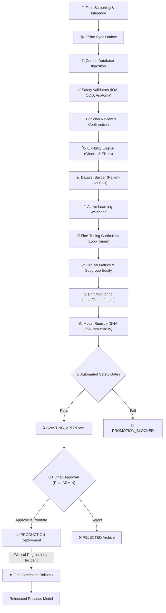

# DrishtiAI — Monthly Continuous Learning Pipeline

## Overview

The **DrishtiAI Continuous Learning Pipeline** is an automated, clinical-grade MLOps subsystem designed to safely and iteratively retrain Diabetic Retinopathy (DR) grading models using confirmed production screening data.

The continuous learning lifecycle strictly enforces **Zero-Trust Clinical Governance**:
- **Zero data leakage:** Rigid patient-level data partitioning guarantees that no patient ever spans both training and evaluation sets.
- **Zero unreviewed pseudo-labels:** Ground truth requires explicit clinician confirmation or verified reference provenance.
- **Zero automated production promotion:** Machine learning candidates are automatically evaluated against multi-dimensional clinical safety gates, but **never** deployed without explicit cryptographic approval by an authorized clinical administrator (`Role.ADMIN`).
- **Instant rollback:** Any deployed model can be rolled back to a previous production version in a single command.

---

## Architectural Flow



---

## Key Modules & Responsibilities

| Module | Location | Purpose |
|---|---|---|
| **Database Migration v5** | [`database.py`](file:///d:/Users/Nitro%205/Downloads/OptiGemma/database.py) | 9 relational tables: `training_datasets`, `training_samples`, `training_runs`, `model_versions`, `model_evaluations`, `model_approvals`, `drift_events`, `data_quality_events`, `training_pipeline_runs`. |
| **Eligibility Engine** | [`engine/learning/eligibility.py`](file:///d:/Users/Nitro%205/Downloads/OptiGemma/engine/learning/eligibility.py) | Assesses candidate scans for image validity, IQA gradability, laterality match, doctor review confirmation, duplicate exclusion. |
| **Data Quality Pipeline** | [`engine/learning/data_quality.py`](file:///d:/Users/Nitro%205/Downloads/OptiGemma/engine/learning/data_quality.py) | Runs format validation, decompression bomb protection, saturation/blank detection, and OOD scoring. |
| **Label Provenance** | [`engine/learning/label_provenance.py`](file:///d:/Users/Nitro%205/Downloads/OptiGemma/engine/learning/label_provenance.py) | Classifies label origins (`DOCTOR_CONFIRMED`, `SECOND_REVIEW_CONFIRMED`, `REFERENCE_DATASET`, `PSEUDO_LABEL`, `AI_ONLY`) and sets trust scores. |
| **Dataset Builder** | [`engine/learning/dataset_builder.py`](file:///d:/Users/Nitro%205/Downloads/OptiGemma/engine/learning/dataset_builder.py) | Implements patient-level splitting (no patient in both train and val/test), locked test manifest isolation, deterministic seeds, and SHA-256 dataset manifests. |
| **Active Learning** | [`engine/learning/active_learning.py`](file:///d:/Users/Nitro%205/Downloads/OptiGemma/engine/learning/active_learning.py) | Priority weights based on prediction uncertainty, doctor-AI disagreement, boundary grade rarity (Mild/Moderate/Severe), and diversity balancing. |
| **Training Integration** | [`training/loop_trainer.py`](file:///d:/Users/Nitro%205/Downloads/OptiGemma/training/loop_trainer.py) | `LoopTrainer.from_production_dataset()` trains on pre-split isolated patient cohorts with progressive unfreezing curriculum. |
| **Model Registry** | [`engine/learning/model_registry.py`](file:///d:/Users/Nitro%205/Downloads/OptiGemma/engine/learning/model_registry.py) | Immutable storage in `models/registry/model-v{timestamp}/` with SHA-256 cryptographic verification and lifecycle state tracking. |
| **Promotion & Rollback** | [`engine/learning/promotion.py`](file:///d:/Users/Nitro%205/Downloads/OptiGemma/engine/learning/promotion.py) | Multi-criteria clinical gates, `Role.ADMIN` authorization, atomic production deployment, and one-command rollback. |
| **Drift Monitoring** | [`engine/learning/drift.py`](file:///d:/Users/Nitro%205/Downloads/OptiGemma/engine/learning/drift.py) | Tracks input feature shifts, model prediction confidence changes, and label distribution divergences. |
| **Pipeline Orchestrator** | [`engine/learning/orchestrator.py`](file:///d:/Users/Nitro%205/Downloads/OptiGemma/engine/learning/orchestrator.py) | End-to-end workflow controller executing monthly retraining runs with fail-safe error isolation. |
| **Scheduler** | [`engine/learning/scheduler.py`](file:///d:/Users/Nitro%205/Downloads/OptiGemma/engine/learning/scheduler.py) | Thread-safe periodic scheduler with execution locks to prevent overlapping runs. |
| **Reporting** | [`engine/learning/report.py`](file:///d:/Users/Nitro%205/Downloads/OptiGemma/engine/learning/report.py) | Generates audit-grade Markdown and JSON reports for clinical and administrative review. |
| **Admin REST API** | [`engine/learning/admin_routes.py`](file:///d:/Users/Nitro%205/Downloads/OptiGemma/engine/learning/admin_routes.py) | 12+ REST endpoints mounted at `/api/admin/*`, strictly protected by `Role.ADMIN` token checks. |

---

## Automated Safety Gates

Prior to advancing a candidate model to `AWAITING_APPROVAL`, the candidate must satisfy all baseline thresholds:

| Metric | Threshold | Clinical Rationale |
|---|---|---|
| **Referable Sensitivity** | $\ge 0.850$ | Missing referable cases (Moderate NPDR or worse) poses direct risk of irreversible vision loss. |
| **Referable Specificity** | $\ge 0.800$ | Prevents overwhelming tertiary ophthalmic clinics with false positives. |
| **Quadratic Weighted Kappa (QWK)** | $\ge 0.750$ | Enforces multi-class concordance across all 5 DR grades (0 to 4). |
| **Expected Calibration Error (ECE)** | $\le 0.150$ | Ensures model confidence probabilities correspond to true empirical error rates. |
| **Vision-Threatening DR False Negatives** | $\le 2$ | Strictest gate: severe NPDR and Proliferative DR cases must not be labeled as normal. |
| **Subgroup Performance Floor** | $\Delta \le 0.05$ | Prevents regression in any specific clinic site, camera device, or demographic cohort. |
| **Drift Gate** | No `CRITICAL_DRIFT` | Blocks models trained on heavily shifted or anomalous distributions. |

---

## Administration API Reference

All administration endpoints require a Bearer token with `Role.ADMIN`:

### Datasets
- `POST /api/admin/datasets/build` — Trigger manual dataset build. Body: `{"val_ratio": 0.15, "test_ratio": 0.10}`
- `GET /api/admin/datasets` — List all versioned datasets with sample counts and manifest hashes.
- `GET /api/admin/datasets/<dataset_id>` — Fetch detailed dataset metadata and sample assignments.

### Training Runs
- `POST /api/admin/training/runs` — Trigger a training run. Body: `{"dry_run": false, "epochs": 4}`
- `GET /api/admin/training/runs` — List recent training runs and execution statuses.
- `GET /api/admin/training/runs/<run_id>` — Get training logs, hyperparameter configuration, and loss curves.

### Model Governance & Approvals
- `GET /api/admin/models` — List registered models. Filter by `?status=CANDIDATE` or `?status=APPROVED`.
- `GET /api/admin/models/<version_id>` — View model metrics, calibration parameters, and SHA-256 integrity verification.
- `POST /api/admin/models/<version_id>/approve` — Clinical administrator approval. Body: `{"reason": "Audited and confirmed by Ophthalmology Review Board"}`
- `POST /api/admin/models/<version_id>/reject` — Reject candidate. Body: `{"reason": "Subgroup sensitivity drop observed"}`
- `POST /api/admin/models/<version_id>/promote` — Atomically deploy approved model to `models/production/model.pt`.
- `POST /api/admin/models/<version_id>/rollback` — Rollback to target version (or previous production model). Body: `{"reason": "Incident response rollback"}`

### Drift & Monitoring
- `GET /api/admin/drift` — Query historical drift events and statistical divergence scores.
- `GET /api/admin/pipeline/status` — Query scheduler status, thread lock state, and recent pipeline executions.
- `POST /api/admin/pipeline/trigger` — Manually trigger an immediate end-to-end retraining cycle.

---

## Operational Runbook

### 1. Triggering a Retraining Run Manually
```bash
curl -X POST http://localhost:5000/api/admin/pipeline/trigger \
  -H "Authorization: Bearer <ADMIN_TOKEN>" \
  -H "Content-Type: application/json" \
  -d '{"dry_run": false, "min_new_cases": 10}'
```

### 2. Reviewing Candidate Report
Audit reports are persisted to `reports/retraining/{pipeline_run_id}_report.md`. Review:
- Cohort count and class balance
- Patient-level split validation
- Sensitivity and specificity vs production baseline
- Subgroup equity breakdown
- Drift severity indicators

### 3. Approving and Promoting Candidate
```bash
# Step 1: Human Approval
curl -X POST http://localhost:5000/api/admin/models/model-v20260908_120000/approve \
  -H "Authorization: Bearer <ADMIN_TOKEN>" \
  -H "Content-Type: application/json" \
  -d '{"reason": "Meets clinical guidelines"}'

# Step 2: Production Promotion
curl -X POST http://localhost:5000/api/admin/models/model-v20260908_120000/promote \
  -H "Authorization: Bearer <ADMIN_TOKEN>"
```

### 4. Emergency Production Rollback
If unforeseen clinical discrepancies occur in the field:
```bash
curl -X POST http://localhost:5000/api/admin/models/latest/rollback \
  -H "Authorization: Bearer <ADMIN_TOKEN>" \
  -H "Content-Type: application/json" \
  -d '{"reason": "Clinician reported sensitivity dip on new camera model"}'
```
This instantaneously reinstates the previous production weights and records an immutable audit log entry.
