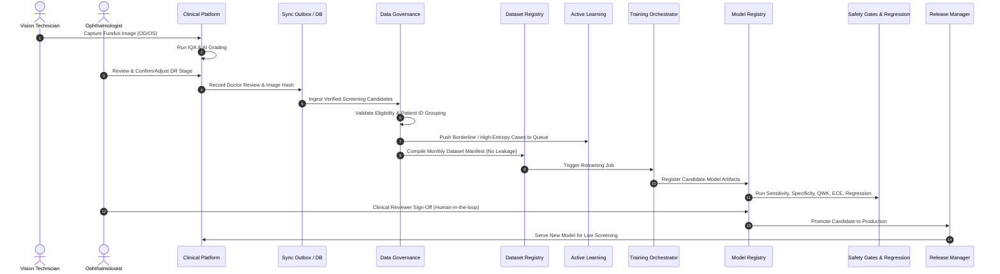

# System Data Flow: Screening to Production Model

This document maps the end-to-end data progression from clinical field capture to model retraining and governed deployment.

```mermaid
sequenceDiagram
    autonumber
    actor Tech as Vision Technician
    actor Doc as Ophthalmologist
    participant Clin as Clinical Platform
    participant Sync as Sync Outbox / DB
    participant Gov as Data Governance
    participant DS as Dataset Registry
    participant AL as Active Learning
    participant Train as Training Orchestrator
    participant Reg as Model Registry
    participant Gates as Safety Gates & Regression
    participant Rel as Release Manager

    Tech->>Clin: Capture Fundus Image (OD/OS)
    Clin->>Clin: Run IQA & AI Grading
    Doc->>Clin: Review & Confirm/Adjust DR Stage
    Clin->>Sync: Record Doctor Review & Image Hash
    Sync->>Gov: Ingest Verified Screening Candidates
    Gov->>Gov: Validate Eligibility & Patient ID Grouping
    Gov->>AL: Push Borderline / High-Entropy Cases to Queue
    Gov->>DS: Compile Monthly Dataset Manifest (No Leakage)
    DS->>Train: Trigger Retraining Job
    Train->>Reg: Register Candidate Model Artifacts
    Reg->>Gates: Run Sensitivity, Specificity, QWK, ECE, Regression
    Doc->>Reg: Clinical Reviewer Sign-Off (Human-in-the-loop)
    Reg->>Rel: Promote Candidate to Production
    Rel->>Clin: Serve New Model for Live Screening
```
