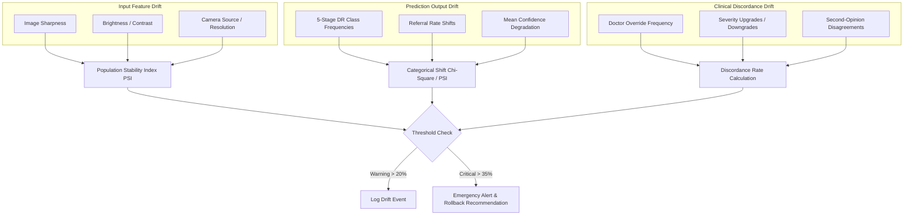

# Drift Surveillance & Discordance Monitoring

## 1. Multi-Tiered Drift Architecture
DrishtiAI monitors three distinct planes of distribution shift:

## 2. Quantitative Thresholds
- **PSI < 0.10**: Stable distribution.
- **0.10 <= PSI < 0.25**: Moderate drift; initiates active learning sampling of drifted clusters.
- **PSI >= 0.25**: Critical drift; alerts administrators and triggers emergency review.
- **Clinical Discordance Rate >= 20%**: Emits WARNING event.
- **Clinical Discordance Rate >= 35%**: Emits CRITICAL event and enables emergency rollback trigger.
